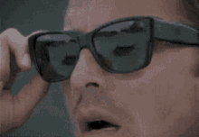

# ascii-image
Generates an ascii representation of an image.

## Maze To Graph Conversions

| Initial Image                                         | ASCII Representation                                                   |
|-------------------------------------------------------|------------------------------------------------------------------------|
|  |  |
|    |    |
|    |  |

## How to run:
1. Get OpenCv from the OpenCv website: https://docs.opencv.org/4.x/d3/d52/tutorial_windows_install.html
2. Add the `opencv\build\x64\vc16\bin` to your windows path
3. Change the file name referenced in main.cpp res/ and CMakeLists.txt to be your file name
4. Get ffmpeg for windows https://github.com/GyanD/codexffmpeg/releases
5. Add the bin file to your windows path.